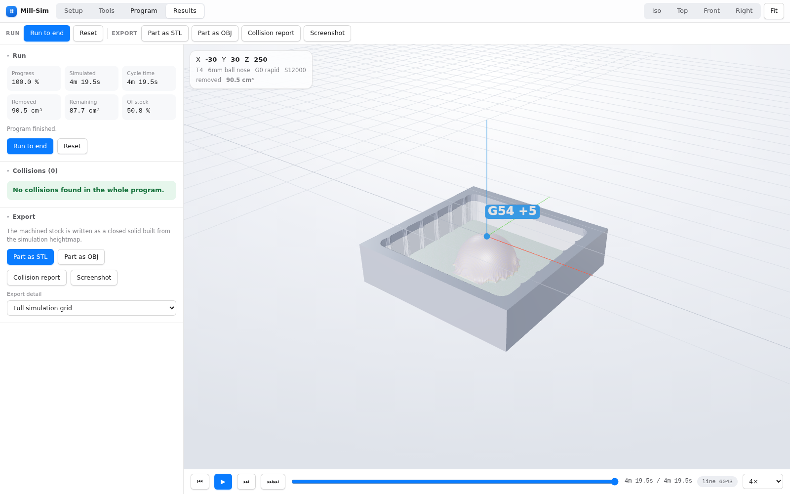

# Mill-Sim

A CNC milling simulator that runs in the browser. Build tools and holders
parametrically, read a G-code program, watch the machine cut a block of
stock, and get told about every crash before the real machine finds it.

No build step, no bundler, no backend. It is plain ES modules plus a
vendored copy of three.js.

## Running it

**No toolchain?** Download [`dist/mill-sim.html`](dist/mill-sim.html) and open
it. That one file is the whole simulator — three.js, every source file, the
stylesheet and all four example programs inlined — so it runs straight off
your filesystem with no install, no server and no Node.

**From source**, which you want if you're going to change anything:

```bash
npm start          # serves on http://localhost:8080
npm test           # 59 unit tests, no browser needed
npm run build      # regenerate dist/mill-sim.html (needs: npm i -D esbuild)
```

There is nothing to `npm install` — the project has no dependencies and
three.js is vendored in `vendor/`. You just need Node 20+.

Serving over HTTP is required when running from source: the app is plain ES
modules, and browsers block module imports over `file://`. Any static server
works — `python3 -m http.server 8080` is fine if you'd rather not use Node.
The single-file build sidesteps this entirely by bundling to one classic
script.

Open the page, pick an example from the **Program** tab, and press play.



---

## What it does

**Parametric tool library.** Eight cutter families — flat, ball, bull nose,
chamfer/V, tapered, drill, face mill and undercut — each generated from its
real dimensions rather than picked from a fixed list. Holders are stacks of
cones running from the nose up to the gauge line, so a stubby shrink-fit
holder and a slim extension behave differently in a deep pocket, as they
should. The taper above the gauge line is deliberately not modelled: it
lives inside the spindle bore and can never touch anything. The gauge line
is the mating face, and the spindle nose starts exactly there. A tool plus a holder plus a stickout is an *assembly*, and
an assembly is what a `T` number selects.

**G-code interpretation.** A full modal interpreter: linear and helical
arcs in all three planes, both `I/J/K` and `R` forms, inch and metric,
absolute and incremental, work offsets, tool-length offsets, canned
drilling cycles, subprogram calls, and reference returns. It reports what
it could not make sense of instead of quietly doing something else.

**Material removal.** The stock is a heightmap and the cutter is a swept
envelope, so what you see is the surface the tool actually leaves —
scallops from a ball nose stepover, the radius a cutter leaves in a square
corner, the ramp from a helical entry.

**Collision checking.** Not just the cutter: the shank, the neck, the
holder and the spindle nose are all part of the crash model, along with
imported fixtures, the table surface and the travel limits.

**Models in and out.** Import STL fixtures, clamps and reference parts,
place them with a gizmo or by typing coordinates, and export the machined
part as STL or OBJ when the run finishes.

---

## Getting around

Four sections in the ribbon, each with its own row of actions underneath.

| Section | What lives there |
| --- | --- |
| **Setup** | The whole job: stock size and position, where work zero is, the fixtures and models clamped around it, the machine, and what the viewport draws. |
| **Tools** | Assemblies, cutters and holders, each with a parametric editor and a live 3D preview. Export the library as JSON, or a single assembly as STL. |
| **Program** | The G-code editor with line numbers, error markers and a highlight that follows the simulation. Program extents, cycle-time estimate and every interpreter note. |
| **Results** | Volume removed, the collision list (click any entry to jump there), and the export buttons. |

Keyboard: `Space` play/pause, `R` reset, `→` step one move, `F` fit view.
During a placement: `X` / `Y` / `Z` lock the move to an axis, `Esc` cancels.

## Placing things by clicking

Typing coordinates to position a vice is a bad way to set up a job. Every
placement tool here is the same conversation instead — click the point, click
where it should go:

- **Move stock** and **Move model** translate the thing so the first point
  lands on the second.
- **Set zero** drops the active work origin straight onto a clicked point;
  **Move G54** shifts it by the distance between two points.

Points snap. Everything near the cursor is projected to the screen and the
closest candidate within a few pixels wins, ranked so a corner beats an edge
and an edge beats a face:

| Colour | Snaps to |
| --- | --- |
| Amber | Block corners and mesh vertices |
| Green | Edge midpoints |
| Blue | Face centres and triangle centroids |
| Purple | Existing work origins |
| Grey | Anywhere on a surface, unsnapped |

The stock snaps to its 26 box features and to the machined surface itself —
the floor of a pocket is clickable, because the ray is walked through the
heightmap rather than against the flat mesh the GPU displaces.

Press `X`, `Y` or `Z` mid-move to lock to one axis, which is how you say "up
40" without hunting for a point that happens to be straight above. Clicking
empty space during a move lands on the plane through the start point rather
than throwing the destination across the room.

---

## How the cutting works

Every solid of revolution in the simulator — cutter, neck, shank, holder,
spindle nose — is described by a silhouette polyline of `{radius, height}`
points. From that, `src/tools/envelope.js` builds a **lower envelope**
table: for a point at radial distance `r` from the tool axis, the lowest
height at which that solid occupies that radius.

That one function answers both questions the simulator needs:

```
cutting     h = min(h, tipZ + LE_flutes(r))     for each stock column
collision   h >     tipZ + LE_body(r)           for each stock column
```

The table is indexed by `r²` rather than `r`, so the inner loop never takes
a square root, and resolution concentrates near the outer edge of the tool
where the profile curves most. A ball nose reproduces its analytic sphere
to within a micron.

The stock is a regular XY grid of columns (a Z-dexel field), each holding
the height of the remaining material. A 16×16 tile pyramid holds the
maximum height of each block, so air moves — most of every program — are
rejected without touching a single column. Rejecting 200,000 air moves
takes about 15 ms.

The simulator is time-sliced: `run(dt, budgetMs)` does as much work as fits
in a frame and returns, so the UI stays responsive whether the program has
80 moves or 80,000.

### What the crash model catches

| Reported as | Meaning |
| --- | --- |
| **Rapid into material** | A `G0` removed material. On the machine that is a crash, not a cut. |
| **Depth of cut exceeds flute length** | Material stands above the top of the flutes inside the cutter's own footprint — the shank is dragging in the cut. Caught even for a plain end mill whose shank is exactly its cutting diameter. |
| **Holder / shank crash** | The holder or spindle nose is buried in the stock, with the depth. |
| **Fixture collision** | Any part of the assembly reached into a fixture or clamp. |
| **Table collision** | The assembly went below the table surface inside its footprint. |
| **Travel limit exceeded** | The tool tip left the machine envelope. |
| **Cutting with spindle stopped** | Material removed with no `M03`/`M04` active. |
| **No tool assembly loaded** | The program selected a `T` number the library has no assembly for. |

The interpreter adds its own notes: a `G43 H` that does not match the
active `T`, an arc whose end point misses the programmed radius, an
`R`-format arc smaller than half its chord, cutter compensation that is
acknowledged but not applied, and macro variables it cannot evaluate.

---

## G-code support

**Motion** `G00` `G01` `G02` `G03` — arcs by `I/J/K` (incremental or
absolute via `G90.1`/`G91.1`) or by `R`, including full circles and helical
interpolation.

**Planes** `G17` `G18` `G19` · **Units** `G20` `G21` · **Distance** `G90`
`G91`

**Offsets** `G54`–`G59`, `G10 L2 P`, `G92`/`G92.1`, `G43`/`G44`/`G49` with
`H`, `G53` machine coordinates

**Cycles** `G73` `G81` `G82` `G83` `G84` `G85` `G89` `G80`, with `G98`/`G99`
return planes, `Q` pecks, `P` dwells and `L` repeats

**Other** `G04` dwell, `G28`/`G30` reference return, `G40`–`G42`,
`G61`/`G64`, `G93`/`G94`/`G95`

**M codes** `M00` `M01` `M02` `M03` `M04` `M05` `M06` `M07` `M08` `M09`
`M30`, and `M98`/`M99` subprogram calls with `L` repeats

**Syntax** `%` markers, `O` numbers, `N` line numbers, `( )` and `;`
comments, `/` block delete

Not supported: macro variables and expressions (`#1`, `[ ]`), cutter radius
compensation as an actual path offset, and rotary axes. Each is reported
rather than silently ignored.

---

## Honest limitations

- **The stock is a heightmap, so it cannot represent undercuts.** Each
  column stores one top surface. This is the standard trade-off for
  interactive 3-axis verification. Undercut tools are drawn and
  collision-checked, but the material beneath an overhang will not be
  removed. The Tools panel says so when you build one.
- **Fixture collision uses each model's oriented bounding box.** A complex
  clamp will read as a slightly bigger block than it is. Import an awkward
  fixture as a few simple pieces for a tighter fit.
- **Three axes only.** There is no rotary kinematics.
- **Cutter compensation is not applied.** The simulated path is the
  programmed centreline, which is what most posted CAM output already is.
- **Feed rates are taken from the program**, not from any cutting model.
  The reference cutting data stored on each tool is for your own notes.

---

## Layout

```
index.html            page shell, import map, WebGL2 check
styles/app.css        the whole stylesheet
src/
  core/util.js        formatting and small helpers
  tools/
    envelope.js       lower-envelope tables — the geometric core
    toolDefs.js       parametric cutters
    holderDefs.js     parametric holders, nose to gauge line
    assembly.js       cutter + holder + stickout -> cut/shank/holder envelopes
    library.js        CRUD, localStorage, JSON import/export
  gcode/
    lexer.js          tokeniser
    interpreter.js    modal state machine -> flat move list
  sim/
    stock.js          heightmap, carving, tile pyramid, surface picking
    collision.js      sphere chains vs boxes, table and limits
    simulator.js      the time-sliced run loop
  scene/
    viewer.js         renderer, camera, lighting
    stockView.js      GPU-displaced heightmap mesh
    toolView.js       lathed assemblies with helical flutes
    toolpathView.js   backplot
    machineView.js    parametric VMC and its kinematics
    modelsView.js     imported models and the transform gizmo
    pickController.js raycasting and snapping for click-to-place
    originView.js     work-origin markers
  io/
    stl.js            STL read/write, OBJ write
    mesh.js           heightmap and lathe triangulation
  ui/                 panels, editor, preview, DOM helpers
  app.js              state, wiring and the frame loop
examples/             the four example programs
scripts/              static server, smoke test, single-file build
test/                 unit tests (node --test)
dist/mill-sim.html    self-contained build, committed so it can just be opened
vendor/three/         three.js r180, MIT
```

Everything under `src/core`, `src/tools`, `src/gcode`, `src/sim` and
`src/io` is free of three.js, which is why the test suite runs in plain
Node with no browser and no mocks.

### Rendering the cut

Rebuilding a million-triangle mesh every frame would not keep up, so the
heightmap lives in a float texture and the stock mesh is a flat grid that
the vertex shader lifts to the current surface. Surface normals come from
the same texture by central difference, so a freshly machined face shades
correctly the instant it changes. Cutting costs one texture upload per
frame instead of a geometry rebuild.

---

## Testing

```bash
npm test           # 59 unit tests: geometry, G-code, simulation, file I/O
npm run smoke      # optional: boots the app in headless Chromium
```

The unit tests check real numbers, not just that nothing threw: facing a
block removes exactly the swept volume, a ball nose matches its analytic
sphere, a `G2` the long way round is 270° and not 90°, `G83` pecks land on
the right depths, the exported STL is closed with outward-facing normals,
and scrubbing backwards and forwards again lands on the identical result.

`npm run smoke` needs Playwright, which is not a dependency:

```bash
npm i -D playwright && npx playwright install chromium
npm run smoke
```

It boots the app, runs the demo bracket end to end and asserts it comes out
clean, then runs the deliberately bad example and asserts every mistake in
it is caught.

---

## Requirements

A browser with WebGL2 — Chrome, Edge, Firefox or Safari 15+. The page
checks and says so plainly if not.

three.js r180 is vendored under `vendor/three/` (MIT, license included).
Nothing else is fetched at runtime.
